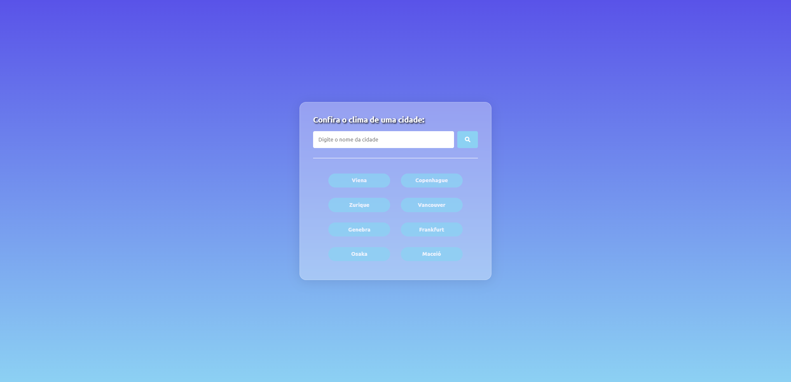
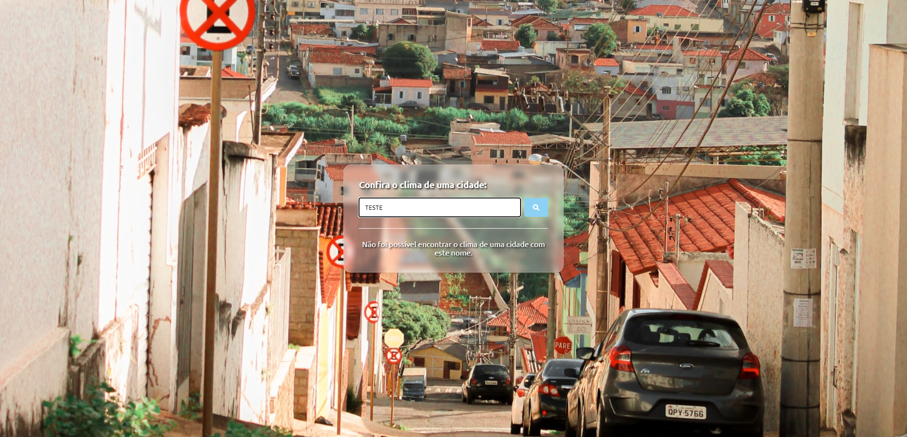

[JAVASCRIPT__BADGE]: https://img.shields.io/badge/Javascript-000?style=for-the-badge&logo=javascript
[HTML__BADGE]: https://img.shields.io/badge/HTML5-E34F26?style=for-the-badge&logo=html5&logoColor=white
[CSS__BADGE]: https://img.shields.io/badge/CSS3-1572B6?style=for-the-badge&logo=css3&logoColor=white
[PROJECT__BADGE]: https://img.shields.io/badge/📱Visit_this_project-000?style=for-the-badge&logo=project
[PROJECT__URL]: https://landing-page-ssr.vercel.app/

<h1 align="center" style="font-weight: bold;">Weather App</h1>

![javascript][JAVASCRIPT__BADGE]
![html][HTML__BADGE]
![css][CSS__BADGE]

    

    

    

